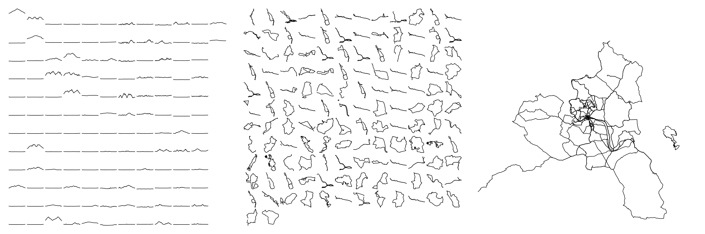
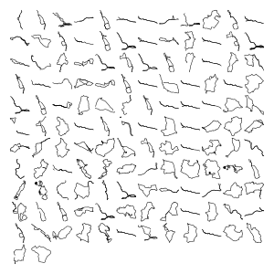
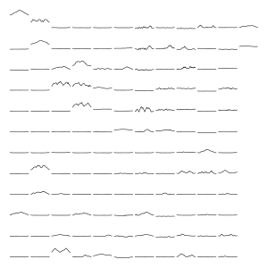
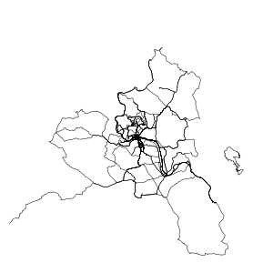

# Stravaviz



[](LICENSE)

`stravaviz` is heavily inspired customized alternative to [flopp/GpxTrackPoster](https://github.com/flopp/GpxTrackPoster).
Compared to `GpxTrackPoster` I got rid of all the texts and the _poster-like_ look and kept only the facets and tracks.

## Usage

First of all, you need directory with a bunch of GPX files. I personally do this by
[requesting all my Strava data](https://www.strava.com/athlete/delete_your_account):
`Strava > Settings > My Account > Download or Delete Your Account > Get Started > Download Request > Request Your Archive`.
You will have to wait for a few minutes and should receive an email with link to zip with all your data.

Than, extract the zip. Depending on what device you use, the activities might be in other format than GPX.
In my case (I used garmin watches), the format it `.fit.gz` and the files need to be decompressed and converted:

```shell
cd export_XXX/activities
find *.gz -maxdepth 1 -type f -exec gunzip {} \;
find *.fit -maxdepth 1 -type f -exec gpsbabel -i garmin_fit -f {} -o gpx -F {}.gpx \;
```

After that you are all set and done to generate the images:

```shell
stravaviz --gpx-dir export_XXX/activities --year 2021 --heatmap-center 55.555,11.111 --heatmap-radius 66
```

### Selection of Tracks

`stravaviz` tries to load all GPX files in the specified directory (option `--gpx-dir`).
Tracks without time stamps and tracks recorded in the wrong year (option `--year`) are discarded.
Tracks shorter than 1km are discarded, too
If multiple tracks have been recorded within one hour, they are merged to a single track.

## Image types

### Facets
The *Facets* layouts all tracks in a grid, starting with the earliest track in the upper left corner of the image, continuing with the second earliest track to the left, and so on.



### Elevations
The *Elevations* layouts all elevation profiles in a grid,  starting with the earliest track in the upper left corner of the image, continuing with the second earliest track to the left, and so on.
Elevation profiles are scaled based on lowest and highest elevation across all activities.



### Heatmap
The *Heatmap* displays all tracks within one "map".



## Setup
1. Clone the repository: `git clone https://github.com/matoous/stravaviz.git`
2. `cd stravaviz`
3. Create virtualenv: `python -m venv venv`
4. Activate virtualenv: `source venv/bin/activate`
5. Install the package: `pip install .`
7. Run `stravaviz` (see above)
8. Deactivate virtualenv: `deactivate`

### My setup

- heatmap for Czech republic around a little bit south from Prague
  ```--heatmap-center 49.944082,14.4354303 --heatmap-radius 120```
- heatmap for Litomerice
  ```--heatmap-center 50.534632,14.1285293 --heatmap-radius 40```

## License
[MIT](LICENSE)
